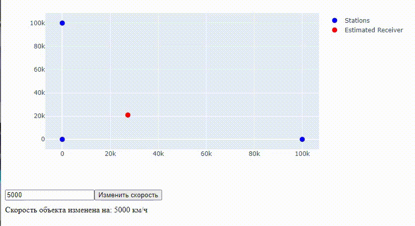

``` python
import numpy as np
import dash
from dash import dcc, html, Input, Output, State
import plotly.graph_objects as go
import asyncio
import websockets
import json
import requests
import threading

# Инициализация Dash
app = dash.Dash(__name__)

# Функция ошибки TDoA
def tdoa_error(params, x1, y1, x2, y2, x3, y3, delta_t12, delta_t13, c):
    x, y = params
    d1 = np.sqrt((x - x1) ** 2 + (y - y1) ** 2)
    d2 = np.sqrt((x - x2) ** 2 + (y - y2) ** 2)
    d3 = np.sqrt((x - x3) ** 2 + (y - y3) ** 2)

    delta_t12_calc = (d1 - d2) / c
    delta_t13_calc = (d1 - d3) / c

    error1 = delta_t12_calc - delta_t12
    error2 = delta_t13_calc - delta_t13

    return [error1, error2]


def loss_function(params, tdoa_error_func, args):
    errors = tdoa_error_func(params, *args)
    loss = sum(e ** 2 for e in errors)
    return loss


def custom_least_squares(tdoa_error_func, initial_guess, args, learning_rate=0.01, max_iterations=10000,
                         tolerance=1e-12):
    x, y = initial_guess
    iteration = 0
    prev_loss = float('inf')

    while iteration < max_iterations:
        loss = loss_function([x, y], tdoa_error_func, args)

        if abs(prev_loss - loss) < tolerance:
            break

        prev_loss = loss

        delta = 1e-6
        loss_x = loss_function([x + delta, y], tdoa_error_func, args)
        grad_x = (loss_x - loss) / delta

        loss_y = loss_function([x, y + delta], tdoa_error_func, args)
        grad_y = (loss_y - loss) / delta

        x -= learning_rate * grad_x
        y -= learning_rate * grad_y

        iteration += 1

    return x, y, iteration


# Инициализация графика
stations_x = [0, 100000, 0]
stations_y = [0, 0, 100000]

# Создание графика
fig = go.Figure()
fig.add_trace(go.Scatter(
    x=stations_x,
    y=stations_y,
    mode='markers',
    name='Stations',
    marker=dict(size=10, color='blue')
))

receiver_marker = fig.add_trace(go.Scatter(
    x=[None],
    y=[None],
    mode='markers',
    name='Estimated Receiver',
    marker=dict(size=10, color='red')
))

# Получение конфигурации LORAN
def get_config():
    response = requests.get("http://localhost:4002/config")
    return response.json()

# Функция для изменения скорости объекта
def update_object_speed(speed):
    payload = {
        "objectSpeed": speed
    }
    response = requests.post("http://localhost:4002/config", json=payload)
    return response.json()

# Асинхронная функция для получения данных через WebSocket
async def receive_data():
    uri = "ws://localhost:4002"
    try:
        async with websockets.connect(uri) as websocket:
            received_times = {}

            while True:
                data = await websocket.recv()
                json_data = json.loads(data)

                print(f"Received data: {json_data}")

                source_id = json_data['sourceId']
                received_at = json_data['receivedAt']
                received_times[source_id] = received_at

                if len(received_times) == 3:
                    receivedAt1 = received_times.get("source1")
                    receivedAt2 = received_times.get("source2")
                    receivedAt3 = received_times.get("source3")

                    if None in [receivedAt1, receivedAt2, receivedAt3]:
                        print("Not all received times are available yet.")
                        continue

                    delta_t12 = ((receivedAt1 - receivedAt2) / 1000) * 10e8
                    delta_t13 = ((receivedAt1 - receivedAt3) / 1000) * 10e8

                    initial_guess = [50000, 50000]
                    c = 3e8 / 10e8
                    x_opt, y_opt, iterations = custom_least_squares(tdoa_error, initial_guess,
                                                                    args=(stations_x[0], stations_y[0],
                                                                          stations_x[1], stations_y[1],
                                                                          stations_x[2], stations_y[2],
                                                                          delta_t12, delta_t13, c))

                    # Обновление графика
                    update_plot(x_opt, y_opt)

                    received_times.clear()

    except Exception as e:
        print(f"Error connecting to WebSocket: {e}")


def update_plot(receiver_x, receiver_y):
    fig.data[1].x = [receiver_x]
    fig.data[1].y = [receiver_y]
    return fig


@app.callback(
    Output('live-graph', 'figure'),
    Input('interval-component', 'n_intervals')
)
def update_graph(n):
    return fig


@app.callback(
    Output('speed-response', 'children'),
    Input('submit-speed', 'n_clicks'),
    State('speed-input', 'value')
)
def change_speed(n_clicks, speed):
    if n_clicks is None or speed is None:
        return "Введите скорость и нажмите 'Изменить скорость'."
    try:
        speed = float(speed)
        response = update_object_speed(speed)
        return f"Скорость объекта изменена на: {response.get('objectSpeed', 'неизвестно')} км/ч"
    except ValueError:
        return "Введите допустимое значение скорости."


# Создание интерфейса
app.layout = html.Div([
    dcc.Graph(id='live-graph', animate=True),
    dcc.Interval(
        id='interval-component',
        interval=1000,  # Обновление каждую секунду
        n_intervals=0
    ),
    html.Div([
        dcc.Input(id='speed-input', type='number', placeholder='Введите скорость (км/ч)'),
        html.Button('Изменить скорость', id='submit-speed', n_clicks=0),
    ]),
    html.Div(id='speed-response', style={'margin-top': '10px'})
])


def run_websocket():
    asyncio.run(receive_data())


if __name__ == "__main__":
    # Получение конфигурации
    config = get_config()
    print(f"Current configuration: {config}")

    # Запуск WebSocket в отдельном потоке
    thread = threading.Thread(target=run_websocket)
    thread.start()

    # Запуск приложения Dash
    app.run_server(debug=True)

```


<p align="center">
  
</p>

<p align="center">
    Результат зі швидкістю об'єкта 5000 м/с
</p>

<p align="center">
  
</p>

<p align="center">
    Результат зі швидкістю об'єкта 25000 м/с
</p>
